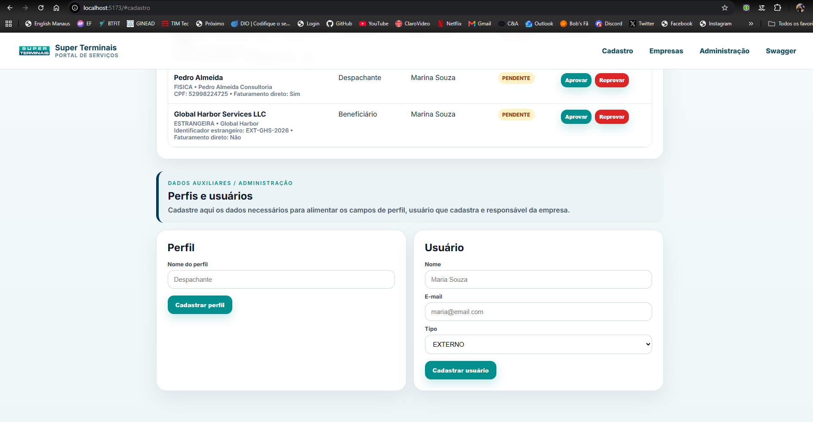
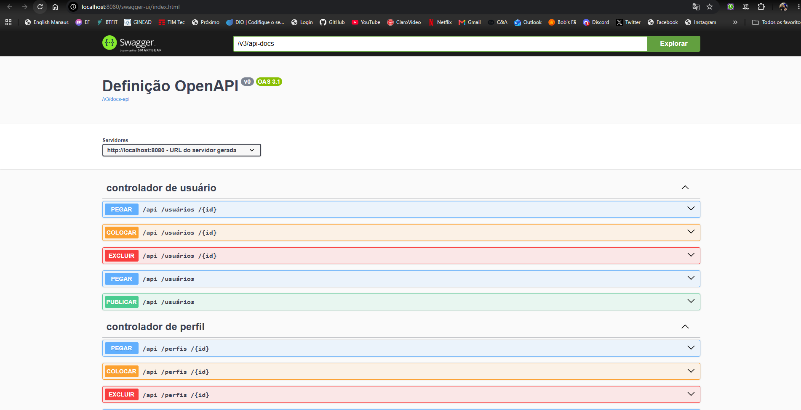

# 🚢 ST Company Registration

> Sistema de cadastro e gerenciamento de empresas desenvolvido como prova técnica para a **Super Terminais**, contemplando análise de requisitos, modelagem UML, desenvolvimento Full Stack, documentação de API e consultas SQL.


---

# 📋 Sobre o Projeto

O **ST Company Registration** foi desenvolvido para atender aos requisitos da avaliação técnica da Super Terminais.

A solução permite o cadastro, gerenciamento e aprovação de empresas por usuários internos e externos, seguindo as regras de negócio definidas na especificação funcional.

O sistema contempla:

* 🏢 Cadastro de Pessoa Jurídica
* 👤 Cadastro de Pessoa Física
* 🌎 Cadastro de Pessoa Estrangeira
* 📋 Gerenciamento de Empresas
* ✅ Aprovação de Cadastros
* ❌ Reprovação de Cadastros
* 👥 Administração de Usuários
* 🏷️ Administração de Perfis
* 📄 Gerenciamento de Documentos
* 🔌 API REST Documentada com Swagger

---

# ✨ Diferenciais Implementados

* Interface moderna desenvolvida com Vue 3
* API REST utilizando Spring Boot
* Documentação automática com Swagger/OpenAPI
* Fluxos distintos para Pessoa Jurídica, Física e Estrangeira
* Aprovação e reprovação de empresas
* Administração de usuários e perfis
* Validação de CPF
* Validação de CNPJ
* Upload de documentos obrigatórios e opcionais
* Arquitetura em camadas
* Diagramas UML completos
* Consultas SQL solicitadas na avaliação

---

# 🛠️ Tecnologias Utilizadas

## Backend

* Java 22
* Spring Boot
* Spring Data JPA
* Maven
* Bean Validation
* OpenAPI / Swagger

## Frontend

* Vue 3
* Vite
* Axios
* CSS3

## Ferramentas

* Git
* GitHub
* Draw.io
* UML

---

# 🏗️ Arquitetura

```text
Frontend (Vue 3)
        │
        ▼
REST API (Spring Boot)
        │
        ▼
Camada de Serviço
        │
        ▼
Camada de Persistência
        │
        ▼
Banco de Dados
```

---

# 📂 Estrutura do Projeto

```text
st-company-registration/
│
├── backend/
│   └── company-registration/
│
├── frontend/
│
├── docs/
│   ├── diagrams/
│   ├── sql/
│   └── screenshots/
│
└── README.md
```

---

# ✅ Funcionalidades Implementadas

## Cadastro de Empresas

* Cadastro de Pessoa Jurídica
* Cadastro de Pessoa Física
* Cadastro de Pessoa Estrangeira
* Associação de Perfil
* Associação de Responsável
* Upload de Documentos
* Faturamento Direto

## Gestão de Empresas

* Listagem de Empresas
* Aprovação de Empresas
* Reprovação de Empresas
* Consulta de Empresas
* Atualização de Status

## Administração

* Cadastro de Perfis
* Cadastro de Usuários
* Controle de Responsáveis

## Validações

* CPF válido
* CNPJ válido
* Perfil obrigatório
* Documento obrigatório
* Arquivos duplicados
* Tipos de arquivo permitidos

---

# 📸 Demonstração do Sistema

## 🏠 Tela Principal do Sistema

Visão geral da aplicação com acesso rápido às funcionalidades principais.


---

## 🏢 Cadastro de Empresa – Pessoa Jurídica

Fluxo de cadastro para empresas nacionais utilizando CNPJ.


---

## 👤 Cadastro de Empresa – Pessoa Física

Fluxo de cadastro para pessoas físicas utilizando CPF.


---

## 🌎 Cadastro de Empresa – Pessoa Estrangeira

Fluxo de cadastro para empresas estrangeiras utilizando identificador internacional.


---

## 📋 Listagem e Aprovação de Empresas

Tela de acompanhamento dos cadastros com aprovação e reprovação de solicitações.


---

## ⚙️ Administração de Perfis e Usuários

Gerenciamento dos perfis e usuários utilizados nos fluxos do sistema.



---

## 🔌 Documentação da API

Documentação automática dos endpoints através do Swagger/OpenAPI.



---

# 📐 Diagramas UML

Os diagramas desenvolvidos para atender aos requisitos da avaliação encontram-se na pasta:

```text
docs/diagrams/
```

## Diagramas Entregues

* ✅ Diagrama de Caso de Uso
* ✅ Diagrama de Classe
* ✅ Diagrama de Atividade

---

# 🧾 Consultas SQL

As consultas da Parte 02 encontram-se na pasta:

```text
docs/sql/
```

Consultas implementadas:

* Funcionários com cargos e departamentos
* Funcionários ativos
* Funcionários da Controladoria
* Funcionários com salário superior a R$ 2.900,00
* Quantidade de funcionários por departamento

---

# 📦 Requisitos Atendidos

| Requisito                 | Status |
| ------------------------- | ------ |
| Backend Java              | ✅      |
| Frontend Vue.js           | ✅      |
| Cadastro de Empresas      | ✅      |
| Aprovação/Reprovação      | ✅      |
| Administração de Usuários | ✅      |
| Administração de Perfis   | ✅      |
| Swagger/OpenAPI           | ✅      |
| Diagrama de Caso de Uso   | ✅      |
| Diagrama de Classe        | ✅      |
| Diagrama de Atividade     | ✅      |
| Consultas SQL             | ✅      |
| Documentação Técnica      | ✅      |

---

# 🚀 Como Executar o Projeto

## Backend

### Windows

```bash
cd backend/company-registration

mvnw.cmd spring-boot:run
```

### Linux / macOS

```bash
cd backend/company-registration

./mvnw spring-boot:run
```

Aplicação disponível em:

```text
http://localhost:8080
```

Swagger:

```text
http://localhost:8080/swagger-ui/index.html
```

---

## Frontend

```bash
cd frontend

npm install

npm run dev
```

Aplicação disponível em:

```text
http://localhost:5173
```

---

# 👨‍💻 Desenvolvedor

**Jonas Santos**

Desenvolvedor Full Stack

GitHub:

https://github.com/jonasjss

---

# 📄 Observação

Projeto desenvolvido exclusivamente para fins de avaliação técnica da Super Terminais, com o objetivo de demonstrar conhecimentos em análise de sistemas, modelagem UML, desenvolvimento Full Stack e banco de dados.

---
